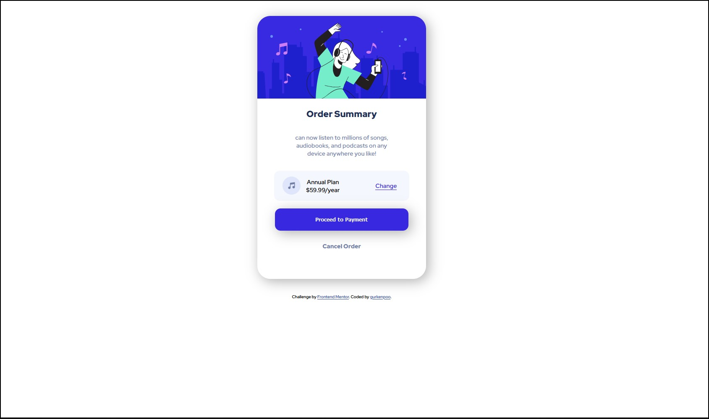

# Frontend Mentor - Order summary card solution

This is a solution to the [Order summary card challenge on Frontend Mentor](https://www.frontendmentor.io/challenges/order-summary-component-QlPmajDUj). Frontend Mentor challenges help you improve your coding skills by building realistic projects. 

## Table of contents

- [Overview](#overview)
  - [The challenge](#the-challenge)
  - [Screenshot](#screenshot)
  - [Links](#links)
- [My process](#my-process)
  - [Built with](#built-with)
  - [What I learned](#what-i-learned)
  - [Continued development](#continued-development)
  - [Useful resources](#useful-resources)
- [Author](#author)
- [Acknowledgments](#acknowledgments)

**Note: Delete this note and update the table of contents based on what sections you keep.**

## Overview

### The challenge

Users should be able to:

- See hover states for interactive elements

### Screenshot



### Links

- Solution URL: [Add solution URL here](https://your-solution-url.com)

## My process
- Starting with HTML layout and aplying Semantic markup
- Once all the HTML where structured, start configuration  the styles
- applying general styles
- Make the containers first, and apply "border:" style to be more easy look it up
- start stlying the rest, such a cards, containers adding flex and wrap
- polish CSS code
### Built with

- Semantic HTML5 markup
- CSS custom properties
- Flexbox

### What I learned

Using flex properties allows you to manage responsive containers, in my case, it help in the way, that i did not use MediaQueries. Using general styles is very good practice.

To see how you can add code snippets, see below:

```html
  <section class="card">
    
    <h1>Order Summary</h1>
    <section class="flexContainer">
  <p class="cardInfo">can now listen to millions of songs, audiobooks, and podcasts on any 
  device anywhere you like!</p>
  <div class="plan">
      
      <div class="price">
    <span>Annual Plan</span>
    <span>$59.99/year</span>
      </div>
    <a href="#">Change</a> 
  </div>
  
  <a href="#" class="linkButton">
    <button>Proceed to Payment
  </button>
</a>
    <a href="" class="cancel">Cancel Order</a> 

</section>
</section>```
```css
.card {
    height: 700px;
    width: 450px;
    border-radius: 35px;
    box-shadow:  7px 7px 34px #afafaf,
             -7px -7px 34px #ffffff;
    text-align: center;
}
```

### Continued development

Using Cards and Boxes structures in HTML, helps me alot to understand the way it works visually. This motivate me to create an ecommerce HTML structure (only HTML and CSS for now). But i want to be able to do it.

### Useful resources

- [Border and Shadow generator](https://neumorphism.io/#e0e0e0) - This helped me for structure the radius and the shadows.
- [Semantic Elements](https://www.w3schools.com/html/html5_semantic_elements.asp) - This is an amazing article which helped me to never foget about the Semantic Elements (VERY GOOD PRACTICE).


## Author

- Website - [gurkenpoo](https://github.com/gurkenpoo)
- Frontend Mentor - [@gurkenpoo](https://www.frontendmentor.io/profile/gurkenpoo)
- Twitch - [@gurkenpoo](https://www.twitch.tv/gurkenpoo)


## Acknowledgments

Im not an advanced dev user, i only want to let you know that you have to make and make and make every site, every challenge to start learning and understanding more faster and safer. Always grateful with the people in twitch who pass in my streams and gave me a hand in everything they can.

